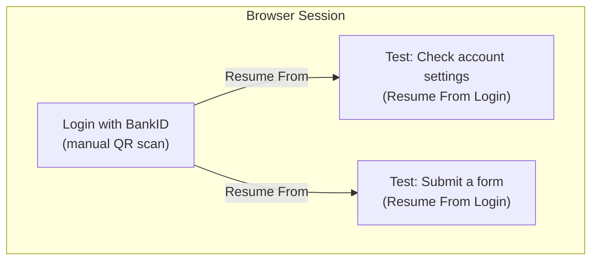

## What is BankID

BankID is a digital identification system widely used in countries like Sweden, Norway, and Finland. It allows individuals to securely prove their identity online and authorize electronic transactions.

## How to test BankID

There are two approaches for handling BankID in your QA.tech tests: **stubbing** BankID in your testing environment, or **manual authentication** using the live screen stream.

---

## Option 1: Stubbing BankID (Recommended)

Stubbing gives you fully automated tests without manual intervention. This requires changes to your application code by your development team.

From BankID's official documentation:

> **How do I test my BankID implementation? How about automation?**
>
> Testing can't be automated. Passwords/Security codes have to be manually entered in the BankID clients. We recommend building a so-called test stub that simulates the BankID service web service. It can also be used to perform load tests on your services.
> https://developers.bankid.com/support

### What is stubbing?

Stubbing replaces the BankID integration with a placeholder that automatically grants access in your testing environment. For example, you accept a specific personnummer like `199001011234` and always grant that user access. This should only be permitted in a _testing_ environment, never in production.

On the client:

```javascript
if (environment === 'testing') {
  // Show stub UI for BankID
} else {
  // Show real BankID
}
```

On the server:

```javascript
if (environment === 'testing') {
  if (personalNumber === '199001011234') // Send an auth success response
  else // Send an auth failed response
} else {
  // Auth using real BankID
}
```

---

## Option 2: Manual Authentication

If you can't stub BankID, you can manually complete the authentication yourself. Since QA.tech live streams the browser screen during test execution, you can watch the test and scan the BankID QR code in real time.

Create a dedicated login test that waits for you to authenticate, and then reuse that login state across all your other tests via [dependencies](/core-concepts/dependencies). You only need to authenticate **once per test run**.

<Steps>
  <Step title="Create a Login Test">
    Create a test with instructions like:

    ```
    Go to the login page and click "Log in with BankID".
    A QR code will appear. Wait up to 10 minutes for the login to complete.
    After login, verify that you are on the logged-in dashboard.
    ```

    The long wait gives you enough time to find the running test, open the live stream, and scan the QR code with your phone.
  </Step>
  <Step title="Run Your Tests">
    Start the test run. The login test will navigate to the BankID login page and wait.
  </Step>
  <Step title="Open the Live Stream and Scan">
    Find the running login test in the QA.tech dashboard and open its live screen stream. You'll see the BankID QR code on screen. Open the BankID app on your phone and scan the QR code shown in the stream.
  </Step>
  <Step title="Complete Authentication">
    Confirm the login in your BankID app. The test will detect that the login succeeded and continue.
  </Step>
</Steps>

### Reusing Login State Across Tests

Set up your other tests to reuse the authenticated session using **Resume From** dependencies. This way the BankID login only happens once.



See [Test Dependencies](/core-concepts/dependencies) for details on how Resume From works.

<Tip>
  The login test's browser state is cached for up to 6 hours. If your BankID session lasts that long, you won't need to re-authenticate between consecutive test runs.
</Tip>
