The SSH Tunnel Proxy feature allows you to securely test applications that are behind firewalls, in private networks, or only accessible from specific servers. This feature routes all your browser testing traffic through an encrypted SSH tunnel.

## When to Use SSH Tunnel Proxy

Perfect for these scenarios:

- **Private/Internal Applications**: Test staging environments or internal tools not exposed to the internet
- **Firewall-Protected Apps**: Access applications behind corporate firewalls or VPNs
- **Security Compliance**: Maintain secure connections when testing sensitive applications
- **Development Environments**: Access local development servers or containerized applications

## How It Works

1. **SSH Connection**: QA.tech establishes a secure SSH connection to your designated server
2. **SOCKS5 Proxy**: Creates a local proxy that forwards all traffic through the SSH tunnel
3. **Browser Configuration**: Automatically configures the test browser to route traffic through the tunnel
4. **Automatic Cleanup**: Cleanly closes the tunnel when your test session ends

## Setup Instructions

<Steps>
  <Step title="Enable SSH Tunnel Proxy">
    Navigate to [**Settings → Network**](https://app.qa.tech/current-project/settings/network) and find the **SSH Tunnel Proxy** section. Toggle the switch to **Enable**.
  </Step>
  <Step title="Configure Connection Details">
    Enter your SSH server details:
    - **SSH Host**: The hostname or IP address of your SSH server (e.g., `jump-server.company.com`)
    - **SSH User**: The username for SSH authentication (e.g., `ubuntu`, `deploy`)
    - **SSH Port**: Custom SSH port (optional, default: 22)
  </Step>
  <Step title="Generate SSH Keys">
    Click **Generate SSH Key** to create a secure key pair. Copy the generated **public key** and add it to your server's `~/.ssh/authorized_keys` file:

    ```bash
    # On your server, add the public key with security restrictions:
    echo 'restrict,port-forwarding,command="/bin/false" ssh-rsa AAAAB3NzaC1yc2E... your-generated-key' >> ~/.ssh/authorized_keys
    chmod 600 ~/.ssh/authorized_keys
    ```

    <Note>
      The `restrict,port-forwarding,command="/bin/false"` prefix is **highly recommended** for security. This prevents QA.tech from getting shell access to your server while still allowing the necessary port forwarding for testing.
    </Note>

  </Step>
  <Step title="Test and Save">
    Click **Test Connection** to verify everything is working, then **Save Configuration** to store your settings securely.
  </Step>
</Steps>

## Server Requirements

Your SSH server needs to support:

- **SSH Protocol 2** (standard on modern systems)
- **Public key authentication**
- **Dynamic port forwarding** (SOCKS proxy support)

Most Linux servers (Ubuntu, CentOS, Amazon Linux) support this out of the box.

## Recommended Architecture

### SSH Jump Server Setup

**Best Practice Architecture:**

1. **SSH Jump Server**: Deploy a dedicated server with a public IP outside your private network
2. **IP Whitelist**: Configure firewall rules to only allow SSH connections from QA.tech IPs
3. **Internal Access**: Allow the jump server to access only the specific web applications needed for testing
4. **Network Segmentation**: Keep your applications in a private network, accessible only via the jump server

**Benefits:**

- ✅ **Minimal Attack Surface**: Only SSH port exposed to internet
- ✅ **Controlled Access**: Jump server only accesses specific applications
- ✅ **Audit Trail**: All connections flow through a single, monitored entry point

### Architecture Diagram

```mermaid
graph TB
    subgraph "QA.tech Infrastructure"
        TestRunner["🧪 Test Runner"]

        subgraph "Isolated Browser Workers"
            Worker1["🖥️ Browser Worker 1<br/>Test Session A"]
            Worker2["🖥️ Browser Worker 2<br/>Test Session B"]
            Worker3["🖥️ Browser Worker 3<br/>Test Session C"]
            Worker4["🖥️ Browser Worker 4<br/>Test Session D"]
            WorkerN["🖥️ Browser Worker N<br/>Test Session N<br/>(up to 10+ parallel)"]
        end

        TestRunner --> Worker1
        TestRunner --> Worker2
        TestRunner --> Worker3
        TestRunner --> Worker4
        TestRunner --> WorkerN
    end

    subgraph "Customer Infrastructure"
        BastionHost["🔐 Bastion Host<br/>(SSH Jump Server)<br/>Public IP with Firewall"]

        subgraph "Private Network"
            WebApp1["🌐 Web Application<br/>10.0.1.100:80/443"]
            WebApp2["🌐 API Server<br/>10.0.1.200:80/443"]
            Database["🗄️ Database<br/>10.0.1.50:5432"]
        end
    end

    Worker1 -.->|"SSH Tunnel<br/>Encrypted Connection"| BastionHost
    Worker2 -.->|"SSH Tunnel<br/>Encrypted Connection"| BastionHost
    Worker3 -.->|"SSH Tunnel<br/>Encrypted Connection"| BastionHost
    Worker4 -.->|"SSH Tunnel<br/>Encrypted Connection"| BastionHost
    WorkerN -.->|"SSH Tunnel<br/>Encrypted Connection"| BastionHost

    BastionHost -->|"HTTP/HTTPS<br/>Port 80/443"| WebApp1
    BastionHost -->|"HTTP/HTTPS<br/>Port 80/443"| WebApp2
    WebApp1 --> Database
    WebApp2 --> Database

    classDef qatech fill:#e1f5fe,stroke:#01579b,stroke-width:2px
    classDef customer fill:#f3e5f5,stroke:#4a148c,stroke-width:2px
    classDef secure fill:#e8f5e8,stroke:#1b5e20,stroke-width:2px
    classDef private fill:#fff3e0,stroke:#e65100,stroke-width:2px

    class TestRunner,Worker1,Worker2,Worker3,Worker4,WorkerN qatech
    class BastionHost secure
    class WebApp1,WebApp2,Database private
```



**Key Architecture Points:**

- **Isolated Workers**: Each browser session runs on a dedicated, isolated worker
- **Per-Session Tunnels**: Fresh SSH connection created for every test
- **Customer Separation**: Workers never handle multiple customers simultaneously
- **Encrypted Transport**: All traffic flows through encrypted SSH tunnels
- **Parallel Testing**: Up to 10+ concurrent browser workers can connect simultaneously

### Whitelist QA.tech IPs for SSH access

<Note>
  Get the current QA.tech IP addresses from [**Settings → Network → IP
  Whitelist**](https://app.qa.tech/current-project/settings/network)
  in your project dashboard.
</Note>

## Security Features

### SSH Key Security

**Recommended SSH Key Restrictions:**

When adding the QA.tech public key to your `~/.ssh/authorized_keys` file, always include these security restrictions:

```bash
restrict,port-forwarding,command="/bin/false" ssh-rsa AAAAB3NzaC1yc2E... your-qa-tech-key
```

**What these restrictions do:**

- `restrict` - Disables all forwarding and other features by default
- `port-forwarding` - Explicitly allows only port forwarding (required for SOCKS proxy)
- `command="/bin/false"` - Prevents shell access, immediately exits if someone tries to get a shell

**Why this matters:** Without these restrictions, the SSH key could potentially be used to gain shell access to your server. These restrictions ensure QA.tech can only create the tunnel connections needed for testing.

### Additional Security Layers

- **Encrypted Key Storage**: Private keys are encrypted and stored securely
- **Isolated Workers**: Each browser session runs on a dedicated worker
- **Per-Session SSH Connections**: A fresh SSH tunnel is created for each browser session
- **No Cross-Customer Data**: Worker isolation prevents any data leakage between customers
- **Automatic Cleanup**: SSH connections and workers are terminated after each test session
- **Limited Scope**: SSH keys only allow port forwarding, no shell or file access

## Parallel Testing Configuration

If you plan to run multiple tests simultaneously, configure your SSH server to handle concurrent connections:

```bash
# In /etc/ssh/sshd_config
MaxSessions 50          # Allow up to 50 concurrent sessions per connection
MaxStartups 30:30:60    # Allow up to 30 pending connections
```

## Troubleshooting

### Connection Failed

- Check SSH server is running: `sudo systemctl status sshd`
- Verify firewall rules allow SSH connections
- Test manual connection: `ssh user@host` from your local machine

### Authentication Failed

- Verify public key was added to `~/.ssh/authorized_keys`
- Check file permissions: `chmod 600 ~/.ssh/authorized_keys`
- Try regenerating keys in the QA.tech interface

### Connection Timeout

- Ensure the SSH host is reachable from QA.tech servers
- Verify QA.tech IPs are whitelisted in your firewall
- Check if SSH daemon allows connections from external IPs

<Note>
  The "Test Connection" button currently does not use our whitelisted IPs, so
  you may see timeout errors when testing if you have configured IP
  whitelisting. This is a known bug - your actual tests will work correctly
  using the whitelisted IPs.
</Note>

### Parallel Connection Issues

- Check your server's SSH configuration for `MaxSessions` and `MaxStartups`
- Monitor server resources (CPU, memory, network) during parallel tests
- Start with fewer parallel connections and scale gradually

## Technical Details

- **Protocol**: SSH-2 with SOCKS5 dynamic port forwarding
- **Encryption**: RSA 2048-bit or Ed25519 key pairs (automatically generated)
- **Timeout**: 30-second connection timeout for reliability
- **Keep-Alive**: Automatic connection maintenance during test sessions

<Note>
  The SSH Tunnel Proxy feature is currently in Beta. If you encounter any issues
  or have feature requests, please contact our support team.
</Note>
