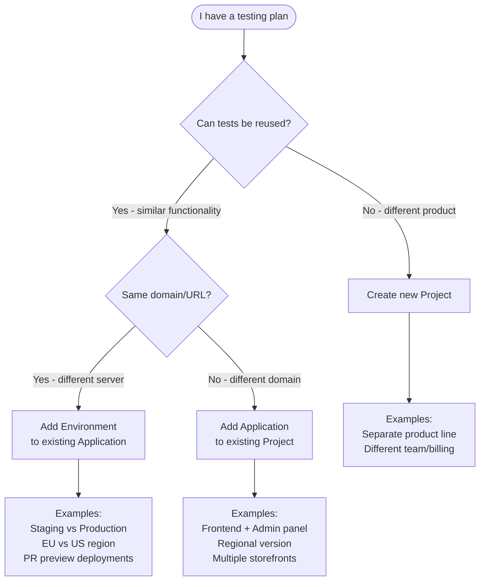

QA.tech uses a hierarchical structure of **projects**, **applications**, and **environments** to organize your testing infrastructure. Understanding when to use each level helps you maximize test reuse and build efficient CI/CD workflows.

## Decision Guide



<Note>
**Golden rule:** Create a new project only if you cannot or do not want to reuse tests from existing applications.

**Test reuse across applications:** Tests can be reused across different applications in the same project. You can create dependencies between tests in different applications using [Wait For dependencies](/core-concepts/dependencies#application-environment-and-domain-constraints), which pass output data (like user IDs or resource names) between tests. 

Browser state (login sessions, cookies) can be shared via Resume From dependencies across applications, but only when both tests use the same Environment. See [Test Dependencies](/core-concepts/dependencies#application-environment-and-domain-constraints) for details on cross-application testing patterns.
</Note>

## Understanding the Hierarchy

### Projects

**Projects** are the top-level container for billing, team access, and organization. 

Use separate projects when:
- Products are completely different (no shared test logic)
- Different teams need separate billing
- You want complete isolation between product lines

<Tip>
**Adding team members:** QA.tech doesn't charge per user, so adding more team members is encouraged. Invite developers, QA engineers, and project managers to the same project so everyone can view test results, create tests, and act on failed tests.
</Tip>

### Applications

**Applications** represent distinct apps or services you want to test. **Test cases belong to applications** - each test is associated with one application. 

Use separate applications when:
- Apps run on different domains and have slightly different functionality
- You need cross-app test flows (e.g., frontend + backend)
- Different apps share similar functionality but have separate deployments

### Environments

**Environments** represent different configurations of the same application - typically different URLs for the same app. 

Use separate environments when:
- Same app, different deployments (staging, production)
- Same app, different regions or markets
- Same app, different preview deployments (PR branches)

**Key benefit:** Tests written for an application can run on any of its environments without modification.

## Common Patterns

### Staging vs Production

**Use case:** Test the same functionality against staging and production environments.

**Structure:** One application with multiple environments.

**Example:**
```
Project: E-commerce Platform
└── Application: Storefront
    ├── Environment: Staging (staging.store.com)
    └── Environment: Production (store.com)
```

**Benefits:** Write tests once, run against both environments. Use test plans to select which environment to test.

### Multi-Market/Storefronts

**Use case:** Test the same functionality across different markets or storefronts.

**Structure:** If same domain pattern (e.g., `store.com/se`, `store.com/de`), use environments. If completely different domains, use separate applications.

**Example with environments:**
```
Project: Global Store
└── Application: Storefront
    ├── Environment: Sweden (store.com/se)
    ├── Environment: Germany (store.com/de)
    └── Environment: US (store.com/us)
```

**Example with applications:**
```
Project: Multi-Brand Platform
├── Application: Germany Storefront (brandname-germany.de)
└── Application: Sweden Storefront (brandname-sweden.se)
```

### Multi-App Flows

**Use case:** Test flows that span multiple applications (e.g., create order in frontend, verify in admin panel).

**Structure:** Multiple applications with test dependencies.

**Example:**
```
Project: E-commerce Platform
├── Application: Customer Frontend
│   └── Environment: Production
└── Application: Admin Panel
    └── Environment: Production
```

**Important:** Browser state (sessions, cookies) doesn't transfer across different domains. When testing across applications with different domains (e.g., `customer.example.com` and `admin.example.com`), use [Wait For dependencies](/core-concepts/dependencies#application-environment-and-domain-constraints) to pass data between tests. Resume From dependencies can work across applications, but only if they're in the same Environment and share the same domain.

### Third-Party Integrations

**Use case:** Test end-to-end flows that require interacting with both your application and a third-party service's web interface in the same test flow.

**When to use this pattern:** Some integrations require your tests to interact with external services that have their own web UIs. For example:
- **OAuth flows:** Your app redirects to Google/Microsoft for authentication, then redirects back
- **Payment providers:** Checkout redirects to Stripe/PayPal payment pages, then returns to your app
- **Admin panels:** You need to configure settings in a third-party admin panel (e.g., HubSpot, Salesforce) before testing your app's integration

<Note>
**API Calls vs Separate Applications:** If you only need to make HTTP requests to third-party APIs (no UI interaction), use [API Call configs](/test-features/api-calls) instead of creating separate applications. API Call configs let you fetch data, authenticate via API, or validate API responses without needing to interact with web UIs. Create separate applications only when your tests need to interact with third-party web interfaces (OAuth redirects, payment pages, admin panels).
</Note>

**Why separate applications:** When your test flow requires interacting with UIs on different domains (your app and the third-party service), you need separate applications because:
- Each application represents a different domain/URL that the browser navigates to
- Browser state (cookies, sessions) doesn't transfer across different domains
- You can configure separate login credentials and test data for each domain
- The test can navigate between your app and the third-party service's UI in a single flow

**Example:**
```
Project: E-commerce Platform
├── Application: Customer Storefront
│   └── Environment: Production (store.example.com)
└── Application: Payment Provider Admin
    └── Environment: Production (dashboard.stripe.com)
```

**Test flow example:**
1. **Test in Payment Provider Admin:** "Configure test payment method" (sets up test data in Stripe dashboard)
2. **Test in Customer Storefront:** "Complete checkout with Stripe" (uses the configured payment method, redirects to Stripe, completes payment, returns to your app)

**Strategy:** 
- Create login tests for each application (your app and the third-party service)
- Use [Wait For dependencies](/core-concepts/dependencies#application-environment-and-domain-constraints) to ensure the third-party configuration completes before testing your app's integration
- Each test starts with fresh browser state on its target domain (browser state doesn't transfer across domains)

## Preview Environments

Preview environments are temporary environments automatically created when you trigger test runs with dynamic URLs via the API. They're perfect for testing pull request deployments, feature branches, and ephemeral CI/CD-created environments.

### How They're Created

Preview environments are **automatically created** when you call the [Start Run API](/api-reference/start-run) with a URL override in the `applications` parameter:

```json
{
  "integrationName": "GitHub Actions",
  "testPlanShortId": "abc123",
  "applications": {
    "frontend-app": {
      "environment": {
        "url": "https://pr-123-frontend.vercel.app",
        "name": "PR-123-Frontend"
      }
    }
  }
}
```

When QA.tech receives this request:
1. It creates a preview environment with `is_preview: true`
2. Associates it with branch/PR metadata (if provided)
3. Runs your tests against the preview URL
4. The preview environment appears in your application settings

**You don't create preview environments manually** - they're created automatically as part of your CI/CD workflow.

### Viewing and Managing Preview Environments

Preview environments appear in **Settings → Applications → [Select Application] → Preview Environments** card.

**Available actions:**
- **Promote to Custom Environment** - Convert a preview environment to a permanent custom environment
- **Delete** - Remove the preview environment (recommended after PRs are merged or branches are deleted)

Preview environments are automatically associated with branch/PR information when created via GitHub Actions or GitLab CI with proper trigger data.

### CI/CD Integration

Preview environments work seamlessly with CI/CD pipelines:

- **[GitHub Actions](/configuration/github-actions)** - Pass preview URLs between jobs
- **[GitLab CI](/configuration/gitlab)** - Use dotenv artifacts to pass preview URLs
- **Any CI/CD platform** - Use the Start Run API with `applications[].environment.url`

For detailed examples, see the [CI/CD Integration Overview](/configuration/ci-cd-integration).

## Test Plans & API Configuration

Test plans allow you to configure which environment and device preset to use per application when running tests. This lets you run the same test cases against different environments (e.g., staging vs production) or with different device configurations (e.g., mobile vs desktop) by selecting different test plans.

**How it works:** When you create a test plan, you can configure application-specific settings that determine which environment URL and device preset to use for each application's tests. These settings are applied whenever the test plan runs, whether triggered manually, via API, or on a schedule. See [Test Plans](/core-concepts/test-plans) for details on creating and configuring test plans.

### Environment Selection

**In Test Plan UI:** Select which environment to use for each application.

**Via API:** You can override environments when triggering runs:

```json
{
  "testPlanShortId": "abc123",
  "applications": {
    "frontend-app": {
      "environment": {
        "url": "https://preview.example.com"
      }
    }
  }
}
```

This allows you to:
- Run the same test plan against different environments
- Test preview deployments dynamically
- Switch between staging and production without changing test plan settings

### Device Preset Configuration

**In Test Plan UI:** Select which device preset to use for each application.

**Via API:** Device preset overrides are **not supported**. To test with different device configurations:

1. Create separate test plans with different device preset settings
2. Trigger the appropriate test plan via API, schedule, or manual execution based on your needs


## Creating Applications & Environments

<Steps>
  <Step title="Navigate to applications settings">
    Go to [**Settings →
    Applications**](https://app.qa.tech/current-project/settings/applications)
    in your project dashboard.
  </Step>
  <Step title="Create new application">
    Click the "Add Application" button and fill in the required details
    including name, color, icon, and default environment information.
  </Step>
  <Step title="Save application">
    Click "Create Application" to save your application with its associated
    environment.
  </Step>
  <Step title="Add additional environments (optional)">
    Select the application, then click "Add Environment" to create additional environments (e.g., staging, production, preview).
  </Step>
</Steps>

