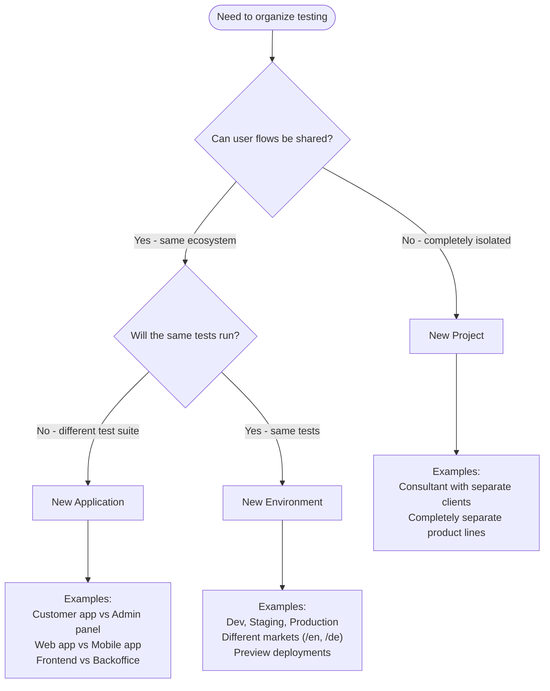

QA.tech uses a hierarchical structure of **projects**, **applications**, and **environments** to organize your testing infrastructure. Understanding when to use each level helps you maximize test reuse and build efficient CI/CD workflows.

## Understanding the Hierarchy

```
Organizations (billing, team management)
└── Projects (team access, complete isolation)
    └── Applications (distinct apps with own test suites)
        └── Environments (same app, different deployments)
```

### Organizations

**Organizations** are the top-level container for your company or team. They contain multiple projects and manage billing and team access at the organization level.

### Projects

**Projects** are containers for team access and complete isolation between product lines.

Use separate projects only when there are no possible shared user flows between the things being tested. For example:
- Completely separate product lines with no shared functionality
- Different teams that need complete isolation
- A consultant working with completely separate clients


### Applications

**Applications** represent distinct apps or services you want to test. **Test cases belong to applications** - each test is associated with one application.

Use separate applications when they have their own set of tests that won't run in other applications. For example:
- Customer-facing app vs admin panel (different test suites)
- Web app vs mobile app (different user flows)
- Frontend vs backoffice (different functionality to test)

### Environments

**Environments** represent different configurations of the same application - typically different URLs for the same app.

Use environments when you want to run the same tests against the same application in different stages or markets. For example:
- Same app, different deployments (dev, staging, production)
- Same app, different markets (/en, /de, /se)
- Same app, different preview deployments (PR branches)

**Key benefit:** Tests written for an application can run on any of its environments without modification.

### Production Environment Toggle

When creating or editing an environment, you can mark it as a production environment using the "Production Environment" toggle. Currently, this setting is used for data collection to understand how many customers run tests against production environments. In the future, we may add additional safety checks to help prevent breaking production environments (such as avoiding overload or more intensive security testing).

## Common Patterns

### Complete Hierarchy Example

Here's a comprehensive example showing the full hierarchy:

**Organization: Pet Solutions Ltd**

```
Project: Veterinary App
├── Applications:
│   ├── Customer Web App
│   ├── Veterinarian Web App
│   ├── Veterinarian Mobile App
│   └── Backoffice Web App
└── Environments: Dev, Staging, Acceptance, Production

Project: Netflix for Pets
├── Applications:
│   ├── Web Video Player
│   ├── Admin App
│   └── Mobile Video Player
└── Environments: Dev, Staging, Production
```

**Why separate projects:** Veterinary App and Netflix for Pets have no shared user flows - they're completely separate products. Different products within the same team should typically be different Applications, not Projects. Only create separate Projects when there's no possible shared user flows (like a consultant working with isolated clients).

### Staging vs Production

**Use case:** Test the same functionality against staging and production environments.

**Structure:** One application with multiple environments.

**Example:**
```
Project: E-commerce Platform
└── Application: Storefront
    ├── Environment: Staging (staging.store.com)
    └── Environment: Production (store.com)
```

**Benefits:** Write tests once, run against both environments. Use test plans to select which environment to test.

### Multi-Market/Storefronts

**Use case:** Test functionality across different markets or storefronts.

**Decision factor:** Will the same tests run in both markets? If yes, use environments. If the markets have different features or user flows requiring different test suites, use separate applications.

**Example with environments (same tests, different markets):**
```
Project: Global Store
└── Application: Storefront
    ├── Environment: Sweden (store.com/se)
    ├── Environment: Germany (store.com/de)
    └── Environment: US (store.com/us)
```

Same checkout flow, same product catalog - just different markets. The same tests run in all environments.

**Example with applications (different test suites):**
```
Project: Multi-Brand Platform
├── Application: Germany Storefront
└── Application: Sweden Storefront
```

Different brands with different features, product catalogs, or checkout flows. Each requires its own set of tests.

### Multi-App Flows

**Use case:** Test flows that span multiple applications (e.g., create order in frontend, verify in admin panel).

**Structure:** Multiple applications with test dependencies.

**Example:**
```
Project: E-commerce Platform
├── Application: Customer Frontend
│   └── Environment: Production
└── Application: Admin Panel
    └── Environment: Production
```

**Important:** Browser state (sessions, cookies) doesn't transfer across different domains. When testing across applications with different domains (e.g., `customer.example.com` and `admin.example.com`), use [Wait For dependencies](/core-concepts/dependencies#application-environment-and-domain-constraints) to pass data between tests. Resume From dependencies can work across applications, but only if they're in the same Environment and share the same domain.

### Third-Party Integrations

**Use case:** Test end-to-end flows that require interacting with both your application and a third-party service's web interface in the same test flow.

**When to use this pattern:** Some integrations require your tests to interact with external services that have their own web UIs. For example:
- **OAuth flows:** Your app redirects to Google/Microsoft for authentication, then redirects back
- **Payment providers:** Checkout redirects to Stripe/PayPal payment pages, then returns to your app
- **Admin panels:** You need to configure settings in a third-party admin panel (e.g., HubSpot, Salesforce) before testing your app's integration

<Note>
**API Calls vs Separate Applications:** If you only need to make HTTP requests to third-party APIs (no UI interaction), use [API Call configs](/test-features/api-calls) instead of creating separate applications. API Call configs let you fetch data, authenticate via API, or validate API responses without needing to interact with web UIs. Create separate applications only when your tests need to interact with third-party web interfaces (OAuth redirects, payment pages, admin panels).
</Note>

**Why separate applications:** When your test flow requires interacting with UIs on different domains (your app and the third-party service), you need separate applications because:
- Each application represents a different domain/URL that the browser navigates to
- Browser state (cookies, sessions) doesn't transfer across different domains
- You can configure separate login credentials and test data for each domain
- The test can navigate between your app and the third-party service's UI in a single flow

**Example:**
```
Project: E-commerce Platform
├── Application: Customer Storefront
│   └── Environment: Production (store.example.com)
└── Application: Payment Provider Admin
    └── Environment: Production (dashboard.stripe.com)
```

**Test flow example:**
1. **Test in Payment Provider Admin:** "Configure test payment method" (sets up test data in Stripe dashboard)
2. **Test in Customer Storefront:** "Complete checkout with Stripe" (uses the configured payment method, redirects to Stripe, completes payment, returns to your app)

**Strategy:** 
- Create login tests for each application (your app and the third-party service)
- Use [Wait For dependencies](/core-concepts/dependencies#application-environment-and-domain-constraints) to ensure the third-party configuration completes before testing your app's integration
- Each test starts with fresh browser state on its target domain (browser state doesn't transfer across domains)

## Decision Guide

If you're unsure which level to use, start by matching your situation to the examples above. If none of the examples fit, use this decision flowchart:



<Note>
**Golden rule:** Create a new project only when there are no possible shared user flows. Different products within the same team should be different Applications, not Projects.

**Test reuse across applications:** Tests can be reused across different applications in the same project. You can create dependencies between tests in different applications using [Wait For dependencies](/core-concepts/dependencies#application-environment-and-domain-constraints), which pass output data (like user IDs or resource names) between tests. 

Browser state (login sessions, cookies) can be shared via Resume From dependencies across applications, but only when both tests use the same Environment. See [Test Dependencies](/core-concepts/dependencies#application-environment-and-domain-constraints) for details on cross-application testing patterns.
</Note>

## Preview Environments

Preview environments are temporary environments automatically created when you trigger test runs with dynamic URLs via the API. They're perfect for testing pull request deployments, feature branches, and ephemeral CI/CD-created environments.


Preview environments are **automatically created** when you call the [Start Run API](/api-reference/start-run) with a URL override in the `applications` parameter:

```json
{
  "testPlanShortId": "pln_abc123",
  "applications": [
    {
      "applicationShortId": "app_frontend",
      "environment": {
        "url": "https://pr-123-frontend.vercel.app",
        "name": "PR-123-Frontend"
      }
    }
  ]
}
```

When QA.tech receives this request:
1. It creates a preview environment with `is_preview: true`
2. Associates it with branch/PR metadata (if provided)
3. Runs your tests against the preview URL
4. The preview environment appears in your application settings

**You don't create preview environments manually** - they're created automatically as part of your CI/CD workflow.

### Viewing and Managing Preview Environments

Preview environments appear in **Settings → Applications → [Select Application] → Preview Environments** card.

**Available actions:**
- **Promote to Custom Environment** - Convert a preview environment to a permanent custom environment
- **Delete** - Remove the preview environment (recommended after PRs are merged or branches are deleted)

Preview environments are automatically associated with branch/PR information when created via GitHub Actions or GitLab CI with proper trigger data.

### CI/CD Integration

Preview environments work seamlessly with CI/CD pipelines:

- **[GitHub Actions](/configuration/github-actions)** - Pass preview URLs between jobs
- **[GitLab CI](/configuration/gitlab)** - Use dotenv artifacts to pass preview URLs
- **Any CI/CD platform** - Use the Start Run API with `applications[].environment.url`

For detailed examples, see the [CI/CD Integration Overview](/configuration/ci-cd-integration).

## Test Plans & API Configuration

Test plans allow you to configure which environment and device preset to use per application when running tests. This lets you run the same test cases against different environments (e.g., staging vs production) or with different device configurations (e.g., mobile vs desktop) by selecting different test plans.

**How it works:** When you create a test plan, you can configure application-specific settings that determine which environment URL and device preset to use for each application's tests. These settings are applied whenever the test plan runs, whether triggered manually, via API, or on a schedule. See [Test Plans](/core-concepts/test-plans) for details on creating and configuring test plans.

### Environment Selection

**In Test Plan UI:** Select which environment to use for each application.

**Via API:** You can override environments when triggering runs:

```json
{
  "testPlanShortId": "pln_abc123",
  "applications": [
    {
      "applicationShortId": "app_frontend",
      "environment": {
        "url": "https://preview.example.com"
      }
    }
  ]
}
```

This allows you to:
- Run the same test plan against different environments
- Test preview deployments dynamically
- Switch between staging and production without changing test plan settings

### Device Preset Configuration

**In Test Plan UI:** Select which device preset to use for each application.

**Via API:** Device preset overrides are supported using the `devicePresetShortId` field in the `applications` array. See [Start Run API](/api-reference/start-run) for details.

### Parameter Precedence

When running tests, QA.tech resolves environment and device preset settings in this order:

1. **Project defaults** - Base configuration from application settings
2. **Test plan parameters** - Overrides configured in the test plan UI
3. **Per-run API overrides** - Overrides passed via API at runtime

Later settings override earlier ones. For example, a per-run API override takes precedence over test plan parameters, which take precedence over project defaults.

<Tip>
Use test plan parameters when you want consistent overrides for a specific test plan. Use API overrides when you need dynamic configuration at runtime (e.g., preview deployments, CI/CD).
</Tip>

## Finding Short IDs for API Usage

When using the [Start Run API](/api-reference/start-run) to override environments, you need Application and Environment Short IDs.

| ID Type | Where to Find | What It's Used For |
|---------|---------------|-------------------|
| Application Short ID | Settings -> Applications (column or dropdown menu) | `applicationShortId` in `applications` array |
| Environment Short ID | Settings -> Applications -> [App] -> Environments (above name) | `environment.shortId` field |

For detailed steps, see [Understanding Different IDs](/api-reference/introduction#understanding-different-ids).

## Creating Applications & Environments

<Steps>
  <Step title="Navigate to applications settings">
    Go to [**Settings →
    Applications**](https://app.qa.tech/current-project/settings/applications)
    in your project dashboard.
  </Step>
  <Step title="Create new application">
    Click the "Add Application" button and fill in the required details
    including name, color, icon, and default environment information.
  </Step>
  <Step title="Save application">
    Click "Create Application" to save your application with its associated
    environment.
  </Step>
  <Step title="Add additional environments (optional)">
    Select the application, then click "Add Environment" to create additional environments (e.g., staging, production, preview).
  </Step>
</Steps>

