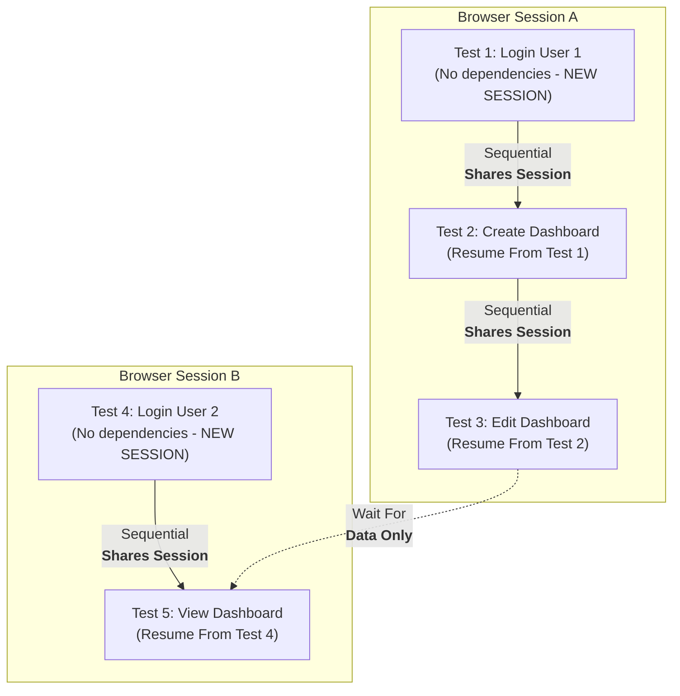
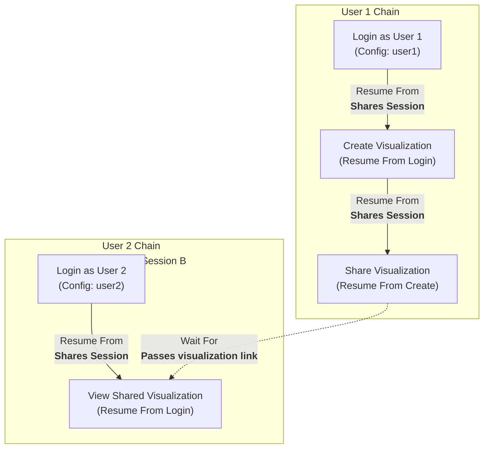

<Note>
  **"Browser session"** = an isolated browser context (BrowserContext) with its own separate cookies, localStorage, and sessionStorage. 
  
  **"Browser state"** = the data stored within a session (login cookies, localStorage values, sessionStorage, etc.)
</Note>

**Use dependencies when:** You're testing workflows (i.e. login → create → edit), need to maintain login sessions across tests, or need to pass data (like created user IDs) between tests. Dependencies ensure tests run in the right order and let you reuse expensive setup like authentication.

Isolated tests not dependent on each other run in parallel (each in its own isolated browser session), so QA.tech can execute up to ~100 tests simultaneously for maximum speed. 

Tests within a dependency chain run sequentially, meaning you'll get faster results with independent tests that are used for testing isolated features and don't depend on each other. 

In practice you will have to use both - independent tests and tests with various combinations dependencies to cover functionality of your Application.


## Dependency Types

### Resume From  
**What it does:** Test inherits browser state (login sessions, cookies, localStorage, sessionStorage) AND output data from the dependency. If the dependency completed successfully within the last 6 hours in the same environment, state is reused immediately. If older or failed, the dependency runs first.

**Use when:** You want to avoid repeated logins or expensive setup by reusing browser state from a previous test in the chain.

### Wait For
**What it does:** Test waits for dependency to complete before starting. Receives output data (user IDs, resource names, URLs) from the dependency test, but starts with a fresh browser session-no shared cookies, localStorage, or login state.

**Use when:** You need execution order and data passing between different user contexts, or when tests need created data but not browser state. For workflows with the same user, use Resume From instead to avoid repeated logins.


## Multiple Dependencies

A test can have multiple dependencies using both "Wait For" and "Resume From" relationships. If any dependency fails, all dependent tests are automatically skipped in that test run.

<Note>
  - Each test can have exactly **one Resume From** dependency (single browser state parent)
  - Each test can have **multiple Wait For** dependencies (coordinate with many tests)
</Note>

## Examples

### Resume From Example
**Test structure:**
1. **Login Test** → 2. **Create Order Test** → 3. **View Dashboard Test**

All three tests share the same browser session, so the browser state (login cookies, localStorage, etc.) is preserved throughout the chain.

### Wait For Example  
**Test structure:**
1. **Create Team Test** (outputs: team name "Marketing Team")
2. **Add User to Team Test** (receives: team name from Test 1)

Tests run sequentially, but each starts with a fresh browser session. Test 2 receives the output data from Test 1.

## Browser Isolation & Parallel Execution

Each independent test chain runs in its own isolated browser session. Tests within a chain run sequentially and share browser state through "Resume From" dependencies, while different chains run in parallel with complete isolation.



**Key points:**
- Session A (Tests 1→2→3) runs sequentially with shared User 1 login
- Session B (Tests 4→5) runs sequentially with shared User 2 login
- Both sessions run in parallel, completely isolated from each other
- Test 5 waits for Test 3 to complete and receives output data, but maintains separate browser state

<Note>
  **"Run Tests" Behavior:** When you click "Run Tests" or trigger a test plan:
  - Independent test chains run in parallel with isolated browser sessions
  - Tests within a chain run sequentially, maintaining dependency order
  - The system auto-scales up to ~100 concurrent agents to maximize parallelization
</Note>

## Multi-User Testing Scenarios

When testing features that require multiple users to be logged in simultaneously (e.g., collaboration, sharing, real-time features), create separate dependency chains for each user.

### Pattern: Testing Collaborative Features

**Scenario:** Test that User 1 can create and share a visualization with User 2, who can then view it.

**Structure:**

**User 1 Chain:**
1. **Login as User 1** (root test, config: `user1@example.com`)
2. **Create Visualization** (Resume From: Login as User 1)
3. **Share Visualization** (Resume From: Create Visualization)

**User 2 Chain:**
1. **Login as User 2** (root test, config: `user2@example.com`) 
2. **View Shared Visualization** (Resume From: Login as User 2, Wait For: Share Visualization)



**How It Works:**
- User 1 chain runs in browser session A (all three tests share User 1's login)
- User 2 chain runs in browser session B (both tests share User 2's login)
- Sessions A and B are completely isolated from each other
- Both users remain logged in throughout their respective chains
- "Wait For" ensures User 2's test waits for sharing to complete
- Output data (visualization link) passes from User 1 to User 2's test
- Browser state (login sessions) remains isolated between chains

**Key Points:**
- Each user gets their own root login test with separate test configuration
- Use different test configurations for different user credentials
- Use "Resume From" within each user's chain to maintain their session
- Use "Wait For" between chains to coordinate timing while keeping sessions isolated
- Tests in different chains run in parallel but maintain complete isolation

<Tip>
  Each user needs their own root login test to ensure they get an isolated browser session. Depending on another user's login will cause the tests to share a session, and one user will log out the other.
</Tip>

## Application, Environment, and Domain Constraints

Browser state can only be shared via Resume From when tests run in the **same Environment**. While you can create dependencies between tests in different Applications, Resume From will only work if both tests are assigned to the same Environment.

### What Works vs. What Doesn't

| ✅ Supported | ❌ Not Supported |
|-------------|-----------------|
| Resume From within the same Environment | Resume From across different Environments |
| Output data passed between any tests, any Application, any Environment | Browser state transfer across different domains |
| Wait For dependencies across different Applications | Cookie/localStorage transfer between `app.example.com` and `admin.example.com` |
| Resume From across different Applications in the same Environment | Using Resume From between staging and production Environments |

### Testing Across Applications

**Use Wait For dependencies across Applications:**
- Tests execute sequentially without browser state transfer
- Output data (user IDs, team names) passes between any tests
- Each test starts with fresh browser state on its target URL

**Example:**
```
Test 1: Create User (Frontend Application) → outputs userId  
Test 2: Verify User (Admin App Application) → waits for Test 1, receives userId
```

**Resume From only works within the same Environment:**
- The system requires both tests to use the same Environment for state reuse
- Even if two Environments have similar URLs, Resume From won't work across different Environments
- Tests in different Applications CAN use Resume From if they're in the same Environment