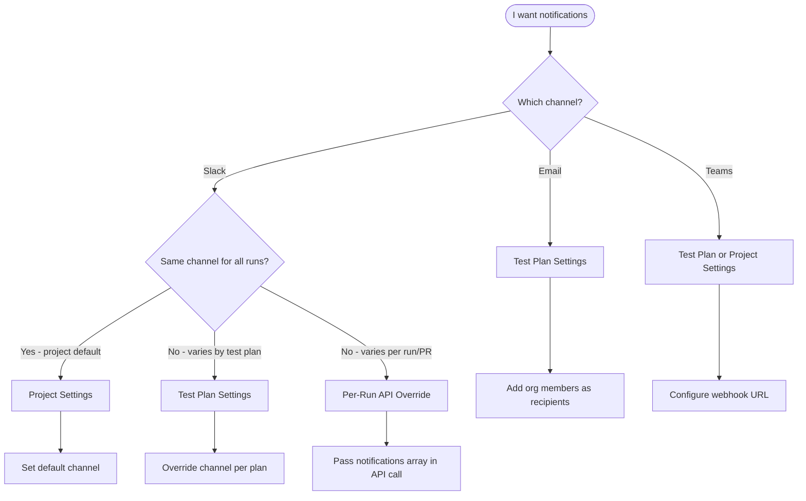

QA.tech notifies your team when test runs complete and provides weekly summaries of testing activity. Configure notifications at the project level for defaults, at the test plan level for customization, or per-run via API for CI/CD workflows.

## Understanding Notifications

### Notification Types

| Type | Purpose | Timing | Channels |
|------|---------|--------|----------|
| Run Completion | Alert team when tests finish | Immediately after run | Slack, Email, Microsoft Teams |
| Weekly Summary | Summarize testing activity | Mondays 6 AM CET | Email only |

### Delivery Channels

| Channel | Project Level | Test Plan Level | Per-Run API |
|---------|---------------|-----------------|-------------|
| Slack | Default channel | Override channel | Override channels |
| Email | - | Add recipients | - |
| Microsoft Teams | Webhook URL | Webhook URL | - |

### Configuration Levels

```
Project Settings (defaults for all runs)
└── Test Plan Settings (override per test plan)
    └── Per-Run API (override per individual run - Slack only)
```

- **Project Level** - Set default Slack channel and Teams webhook. All runs use these unless overridden.
- **Test Plan Level** - Override Slack channel, add email recipients, configure Teams webhook per test plan.
- **Per-Run API** - Override Slack channels dynamically when triggering runs via API. Useful for CI/CD.

<Note>
Per-run API overrides only support Slack. Email and Teams notifications cannot be overridden via API - configure them at the test plan level instead.
</Note>

## What You Receive

### Run Completion Notifications

All run completion notifications (Slack, Email, Teams) include:

| Content | Description |
|---------|-------------|
| Run status | Pass or fail with visual indicators |
| Test plan name | If run was part of a test plan |
| Timing | When started and total duration |
| Test summary | Total tests, failed count, error count |
| Failed tests | Up to 5 failed tests with names and failure reasons |
| Results link | Direct link to full test report |

You receive a notification for every completed run - whether triggered manually, through CI/CD, or via schedule.

### Weekly Summary Reports

Weekly summaries are separate from run completion notifications. They provide organization-wide metrics to all members.

**When**: Every Monday at 6 AM Central European Time  
**Who**: All organization members (unsubscribe via email footer)

**Contents**:
- Tests executed count
- Pass percentage
- Time saved estimate
- Suggested new tests to add
- Summary of test runs

## Common Patterns

### Team-Wide Slack Alerts

**Goal**: Everyone on the project sees test results in a shared channel.

**Setup**: Configure default Slack channel at Project Settings → Integrations → Slack. All runs notify this channel automatically.

### Stakeholder Email Notifications

**Goal**: Product managers or executives receive email updates for specific test plans.

**Setup**: Open test plan → Notification settings → Add email recipients. Choose "Only on failure" to reduce email volume.

### CI/CD-Triggered Notifications

**Goal**: Tests triggered via GitHub Actions or GitLab CI notify the team automatically.

**Setup**: Runs triggered via API use project defaults. No additional configuration needed - notifications flow to configured channels.

**Guides**: [GitHub Actions](/configuration/github-actions) | [GitLab CI](/configuration/gitlab) | [Start Run API](/api-reference/start-run)

### PR-Specific Slack Channels

**Goal**: Route notifications for a specific PR to a dedicated Slack channel.

**Setup**: Use per-run API overrides to specify channels dynamically:

```json
{
  "testPlanShortId": "abc123",
  "notifications": [
    { "type": "slack", "channel": "C0478ABCDEF", "notifyOn": "always" }
  ]
}
```

### Failure-Only Routing

**Goal**: Reduce noise by only notifying on failures.

**Setup**: 
- **Email/Teams**: Set "Only on failure" in test plan notification settings
- **Slack API override**: Use `"notifyOn": "failure"` in the notifications array

## Decision Guide

Use this flowchart to determine where to configure notifications:



| I want to... | Configure at |
|--------------|--------------|
| Set default Slack channel for all runs | Project Settings → Integrations → Slack |
| Add email recipients for a test plan | Test Plan → Notification Settings |
| Send to different Slack channels per test plan | Test Plan → Notification Settings |
| Send to different Slack channels per PR/run | Per-Run API (`notifications` array) |
| Set up Microsoft Teams notifications | Project Settings or Test Plan Settings |
| Receive weekly summaries | Automatic for all org members |

## Setup by Channel

### Slack

<Steps>
  <Step title="Connect Slack to Organization">
    Go to Organization Settings → Connections and connect your Slack workspace.
  </Step>
  <Step title="Set Project Default Channel">
    Go to Project Settings → Integrations → Slack and select a default channel.
  </Step>
  <Step title="(Optional) Override Per Test Plan">
    Open a test plan → Click settings icon (gear) next to Notifications → Select a different Slack channel.
  </Step>
</Steps>

The QA.tech bot must be invited to any channels you want to use.

### Email

Email notifications are configured per test plan - there is no project-level default.

<Steps>
  <Step title="Open Test Plan">
    Navigate to your test plan from the Test Plans page.
  </Step>
  <Step title="Open Notification Settings">
    Click the settings icon (gear) next to **Notifications** on the test plan page.
  </Step>
  <Step title="Add Recipients">
    Search for organization members by name or email and add them as recipients.
  </Step>
  <Step title="Choose Frequency">
    Select **Every completion** (all runs) or **Only on failure** (failures only).
  </Step>
</Steps>

<Note>
Email recipients must be organization members. External email addresses are not supported.
</Note>

### Microsoft Teams

Teams notifications use incoming webhooks. See [Microsoft Teams Integration](/integrations/microsoft-teams) for detailed webhook setup instructions.

<Steps>
  <Step title="Create Incoming Webhook in Teams">
    Follow Microsoft's guide to create an incoming webhook for your Teams channel.
  </Step>
  <Step title="Add Webhook URL">
    Go to Project Settings → Integrations → Microsoft Teams, or configure at the test plan level via Notification Settings.
  </Step>
  <Step title="(Optional) Configure Frequency">
    Choose **Every completion** or **Only on failure** in test plan settings.
  </Step>
</Steps>

## Advanced Configuration

### Per-Test-Plan Settings

Access test plan notification settings by clicking the settings icon (gear) next to **Notifications** on any test plan page. You can configure:

| Setting | Description |
|---------|-------------|
| Slack channel | Override project default for this test plan |
| Email recipients | Add organization members to receive emails |
| Email frequency | Every completion or only on failure |
| Teams webhook | Add Teams webhook URL for this test plan |
| Teams frequency | Every completion or only on failure |

Each test plan can have different notification settings, allowing you to:
- Route critical test plans to dedicated alert channels
- Add stakeholders to specific test plans
- Use different Teams channels for different test plans

### Per-Run API Overrides (Slack Only)

When triggering runs via the [Start Run API](/api-reference/start-run), you can override Slack notification destinations for that specific run.

```json
{
  "testPlanShortId": "abc123",
  "notifications": [
    { "type": "slack", "channel": "C0478ABCDEF", "notifyOn": "always" },
    { "type": "slack", "channel": "C0123FAIL42", "notifyOn": "failure" }
  ]
}
```

**Key points**:

| Behavior | Description |
|----------|-------------|
| Channel format | Use Slack channel ID (e.g., `C0478ABCDEF`), not channel name |
| `notifyOn: "always"` | Receive start and finish notifications (default) |
| `notifyOn: "failure"` | Receive finish notifications only when result is not `PASSED` |
| Default skipped | When overrides provided, project default channel is skipped |
| Bot access | QA.tech bot must be invited to specified channels |

<Warning>
Per-run API overrides only support Slack. Email and Microsoft Teams cannot be overridden via API - use test plan settings instead.
</Warning>

For complete API documentation, see [Start Run API Reference](/api-reference/start-run).
